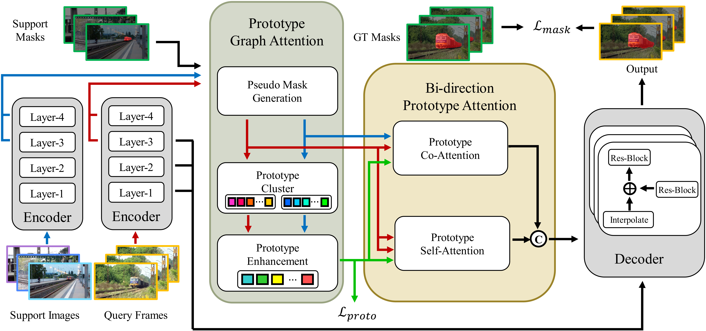

# HPAN: Holistic Prototype Attention Network for Few-Shot Video Object Segmentation

## Overview

This code is for the paper "Holistic Prototype Attention Network for Few-Shot Video Object Segmentation".

The architecture of our Holistic Prototype Attention Network:



## Environment

```sh
git clone git@github.com:HPAN-FSVOS/HPAN.git
cd HPAN
conda create -n HPAN python=3.9
conda activate HPAN
conda install pytorch torchvision torchaudio cudatoolkit=10.2 -c pytorch
pip install -r requirements.txt

# https://github.com/youtubevos/cocoapi.git
git clone git@github.com:youtubevos/cocoapi.git
cd cocoapi/PythonAPI
python setup.py build_ext install
```

## Usage

### Preparation

1. Download the 2019 version of [Youtube-VIS](https://youtube-vos.org/dataset/vis/) dataset.
2. Put the dataset in the `./data` folder.

```tree
data
└─ Youtube-VOS
    └─ train
        ├─ Annotations
        ├─ JPEGImages
        └─ train.json
```

1. Install [cocoapi](https://github.com/youtubevos/cocoapi) for Youtube-VIS.
2. Download the ImageNet pretrained [backbone](https://drive.google.com/file/d/1PIMA7uG_fcvXUvjDUL7UIVp6KmGdSFKi/view?usp=sharing) and put it into the `pretrain_model` folder.

```tree
pretrain_model
└─ resnet50_v2.pth
```

### Train

```python
% PAANet with proto_loss
CUDA_VISIBLE_DEVICES=0 python train_HPAN.py --batch_size 8 --num_workers 8 --group 1 --trainid 0 --lr 5e-5 --with_prior_mask --with_proto_attn --proto_with_self_attn --proto_per_frame 5 --with_proto_loss
```

### Test

```python
% PAANet with proto_loss
CUDA_VISIBLE_DEVICES=0 python test_HPAN.py --group 1 --trainid 0  --test_num 1 --finetune_idx 1 --test_best --lr 2e-5 --with_prior_mask --with_proto_attn --proto_with_self_attn --proto_per_frame 5 --with_proto_loss
```

You can download our pretrained [model](https://github.com/HPAN-FSVOS/HPAN/releases/download/pretrained_model/workdir.zip) to test.

### Result

|Methods| Publish| Query| Mean F| Mean J|
|---|---|---|---|---|
|PMM (Yang et al. 2020)| ECCV 2020| Image| 47.9| 51.7|
|PFENet (Tian et al. 2020)| TPAMI 2020| Image| 46.8| 53.7|
|PPNet (Liu et al. 2020)| TPAMI 2020| Image| 45.6| 57.1|
|RePRI (Boudiaf et al. 2021)| CVPR 2021| Image| -| 59.5|
|DANet w/o OL (Chen et al. 2021)| CVPR 2021| Video| 55.6| 57.2|
|DANet (Chen et al. 2021)| CVPR 2021| Video| 56.3| 58.0|
|TTI w/o DCL (Siam et al. 2022)| arXiv 2022| Video| -| 60.3|
|TTI (Siam et al. 2022)| arXiv 2022| Video| -| 60.8|
|HPAN w/o OL| This paper| Video| 61.4| 62.2|
|HPAN| This paper| Video|  62.4| 63.5|

## References

Part of the code is based upon:

+ [Yang-Bob/PMMs](https://github.com/Yang-Bob/PMMs)
+ [Jia-Research-Lab/PFENet](https://github.com/Jia-Research-Lab/PFENet)
+ [lyxok1/STM-Training](https://github.com/lyxok1/STM-Training)
+ [scutpaul/DANet](https://github.com/scutpaul/DANet)
